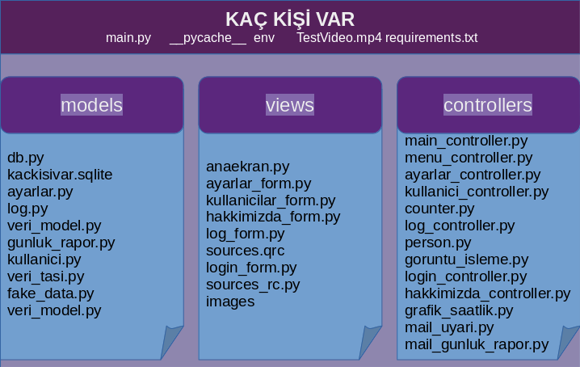
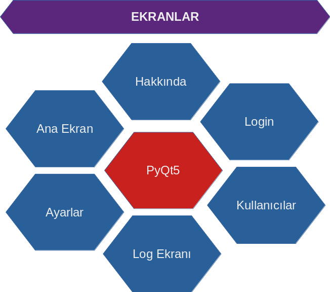
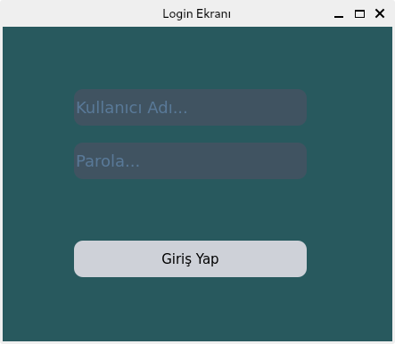
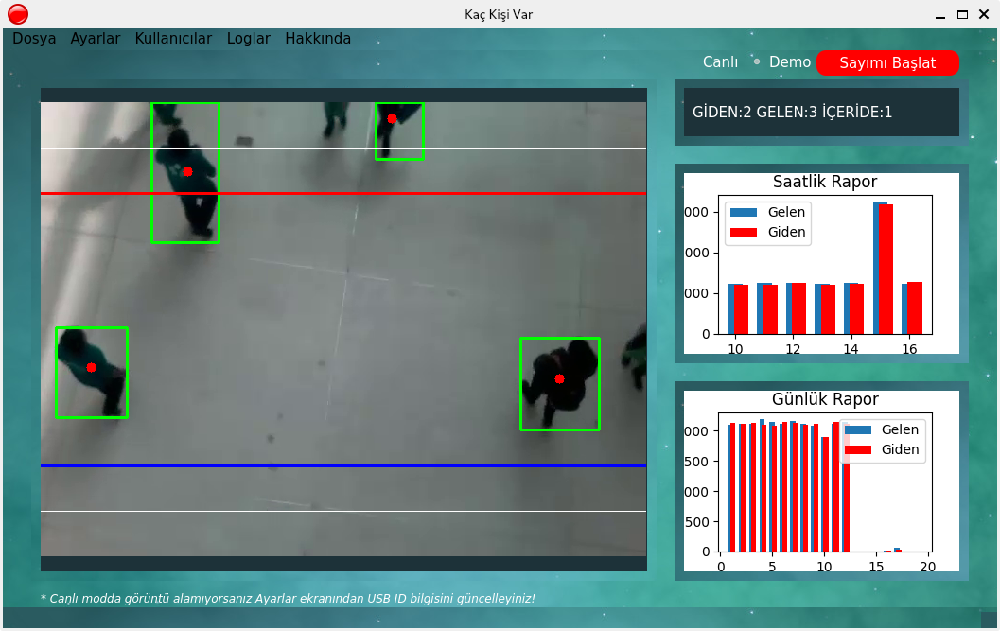
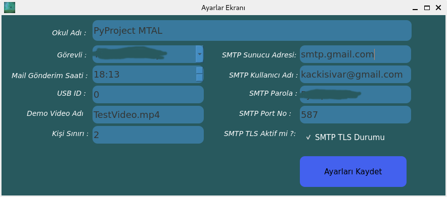
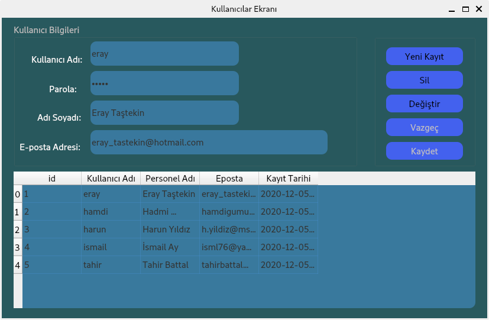
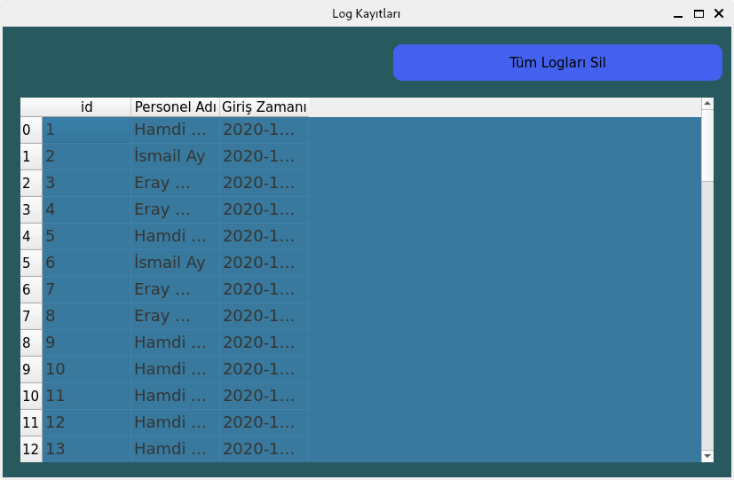
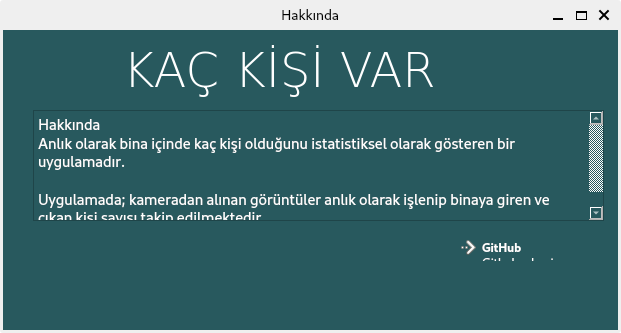

# KAÇ KİŞİ VAR
Anlık bina içinde kaç kişi olduğunu istatistiksel olarak gösteren bir uygulama

### Proje 4 ana bileşenden oluşmaktadır:

1. Deney düzeneğinin oluşturulması ( Kamera sisteminin kurulumu)
2. Görüntü işleme süreci sonunda elde edilen verilerin veri tabanına kayıt edilmesi
3. Uyarı sistemi ile verilerin e-posta ile sorumlu kişilere iletilmesi
4. Saatlik ve günlük istatistiki verilerin sunulması

# MVC Yapısı

# Ekranlar

### Login Ekranı

### Ana Ekran

### Ayarlar Ekranı

### Kullanıcılar Ekranı

### Log Ekranı

### Hakkında Ekranı

